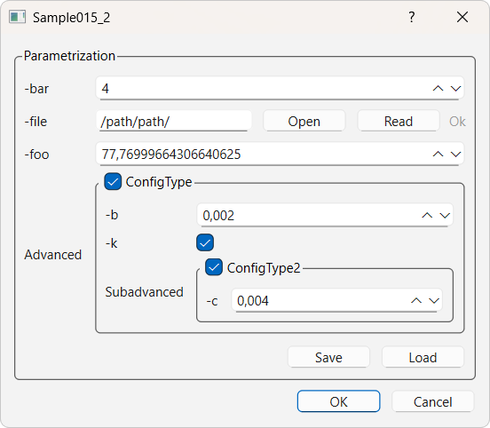

# GUI Parametrization from a json file

In the json file, each parameter must have the following members. 

- **var_name** : the name of the variable in the sources

- **type** : the type of the parameter

- **description** : a comment describing the parameter

- **value** : the default value of the parameter.

The json values can be blank for members *description* and *value*.

Let us consider the following parametrization in a file named *parametrization_gui.json* :

```json
{
    "Parametrization": {
        "-bar": {
            "var_name": "bar",
            "type": "int",
            "description": "bar description",
            "value": 4
        },
        "-foo": {
            "var_name": "foo",
            "type": "float",
            "description": "foo description",
            "value": 77.77
        },
        "-file": {
            "var_name": "file",
            "type": "SlvFile",
            "description": "file description",
            "value": "/path/path/"
        },
        "Advanced": {
            "description": "Advanced description",
            "ConfigType": {
                "-k": {
                    "var_name": "kernel",
                    "type": "bool",
                    "description": "kernel description",
                    "value": true
                },
                "-b": {
                    "var_name": "bound",
                    "type": "double",
                    "description": "bound description",
                    "value": 0.002
                },
                "Subadvanced": {
                    "description": "Subadvanced description",
                    "ConfigType2": {
                        "-c": {
                            "var_name": "contour",
                            "type": "double",
                            "description": "contour description",
                            "value": 0.004
                        }
                    }
                }
            }
        }
    }
}
```

In CMake, the parametrization can be parsed into a header compatible with glove:

```cmake
include("glv_parametrization_parser.txt")
glv_parametrization_parser(parametrization_gui.json parametrization_gui.h)
```

The file *glv_parametrization_parser.txt* is can be found in the *CMake* directory of the repository.

Finally, the header can be included in the sources of the main project.

```cpp
#include "parametrization_gui.h"

int main(int argc, char* argv[]) {

    GLOVE_APP_PARAM(Parametrization);

    ...

}
```

And the parametrization window renders as:



More details in [sample015_2.cpp](/src/src_samples/src_sample015_2/sample015_2.cpp).
