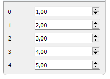

# [GlvArrayWidget](/src/src_glove/GlvArrayWidget.h)



Widget designed to manage a <code>std::array</code>.

```cpp
#include "GlvArrayWidget.h"
#include "GlvWidgetData_spec_AT.h"// because value type in the example is among arithmetic types (float)
```

```cpp
std::array<float, 5> array({ 1.f, 2.f, 3.f, 4.f, 5.f });
GlvArrayWidget<float, 5> array_widget(array);
array_widget.show();
```
