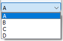

# [GlvEnumWidget](/src/src_glove_add/GlvEnumWidget.h)



Widget designed to manage an <code>enum</code> created with <code>glvm_SlvEnum</code>.

```cpp
#include "GlvEnumWidget.h"
glvm_SlvEnum(EnumName, A, B, C, D)
```

```cpp
GlvEnumWidget<EnumName> enum_widget;
enum_widget.show();
```
