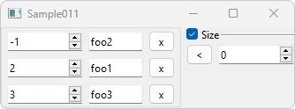

# [GlvMapWidget](/src/src_glove/GlvMapWidget.h)



Widget designed to manage a <code>std::map</code>.

```cpp
#include "GlvMapWidget.h"
#include "GlvWidgetData_spec_AT.h"// because key and value types in the example are among arithmetic types
```

```cpp
std::map<int, std::string> map({ {2, "foo1"}, {-1, "foo2"} , {3, "foo3"} });
GlvMapWidget<int, std::string> map_widget(map);
map_widget.show();
```

More details in [sample011.cpp](/src/src_samples/src_sample011/sample011.cpp).
