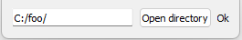

# [GlvOpenDirectory](/src/src_glove/GlvOpenDirectory.h)

Widget designed for opening a directory. The mention *Ok* is greyed if the directory does not exist. The path of the directory can be modified directly in the left entry.
