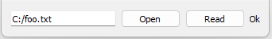

# [GlvOpenFile](/src/src_glove/GlvOpenFile.h)

Widget designed for opening a file either in read or write mode. The right button can be toggled to change the mode. The mention *Ok* is greyed if the file does not exist. The path of the file can be modified directly in the left entry.
