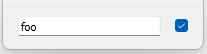

# [GlvPairWidget](/src/src_glove/GlvPairWidget.h)



Widget designed to manage a <code>std::pair</code>.

```cpp
#include "GlvPairWidget.h"
#include "GlvWidgetData_spec_AT.h"// because value types in the example are among arithmetic types
```

```cpp
std::pair<std::string, bool> pair({"foo", true});
GlvPairWidget<std::string, bool> pair_widget(pair);
pair_widget.show();
```
