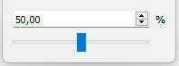

# [GlvProportionWidget](/src/src_glove_add/GlvProportionWidget.h)

Widget designed to manage a [SlvProportion](/src/src_sleeve/SlvProportion.h) in the range [0,1]. The interface controls the value as a percentage.

The sampling of the value using the widget interactions (slider or spinbox arrows) can be modified. Default is 100, *i.e* steps of 1%.

More details in [sample013.cpp](/src/src_samples/src_sample013/sample013.cpp).
