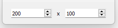

# [GlvSize2dWidget](/src/src_glove_add/GlvSize2dWidget.h)

Widget designed to manage a [SlvSize2d](/src/src_sleeve/SlvSize2d.h).

More details in [main016.cpp](/src/examples/src_main016/main016.cpp).
