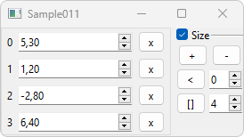

# [GlvVectorWidget](/src/src_glove/GlvVectorWidget.h)



Widget designed to manage a <code>std::vector</code>.

```cpp
#include "GlvVectorWidget.h"
#include "GlvWidgetData_spec_AT.h"// because value type in the example is among arithmetic types (float)
```

```cpp
std::vector<float> vector({ 5.3f, 1.2f, -2.8f, 6.4f });
GlvVectorWidget<float> vector_widget(vector);
vector_widget.show();
```

More details in [sample011.cpp](/src/src_samples/src_sample011/sample011.cpp).
