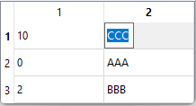

# Model View

## SlvPool

Example of how to use table view with [SlvPool](/src/src_sleeve/SlvPool.h)

```cpp
// Simple SlvPool element: must inherit SlvLabeling. Here, int is the 'key'.
// Input/output in item view depends on operator>> and operator<<
struct Element : public SlvLabeling<int> {
    std::string value;
    Element(int _label = 0):SlvLabeling(_label) {}
    Element& operator=(const Element& _element) {
        value = _element.value;
        return *this;
    }
    friend std::istream& operator>>(std::istream& _is, Element& _element) {
        _is >> _element.value;
        return _is;
    }
    friend std::ostream& operator<<(std::ostream& _os, const Element& _element) {
        _os << _element.value;
        return _os;
    }
};
```

```cpp
SlvPool<Element> pool;
pool.new_element(10)->value = "CCC";
pool.new_element(0)->value = "AAA";
pool.new_element(2)->value = "BBB";

// Simple display of a pool
GlvTableView< SlvPool<Element> >* table_view = new GlvTableView< SlvPool<Element> >(pool);
table_view->show();
```



More details in [sample005.cpp](/src/src_samples/src_sample005/sample005.cpp).