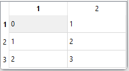

# Model View

## Basic

Example of how to create a simple table from a <code>std::vector< std::vector<> ></code>.

```cpp
typedef float Tvalue;// Any type provided >> and << operators are defined
// Use alias for std::vector<std::vector<>> for simplicity
template <class T>
using Matrix = std::vector< std::vector<T> >;
```

```cpp
GlvTableView< Matrix<Tvalue> >* table_view2D = new GlvTableView< Matrix<Tvalue> >(matrix2D);
table_view2D->show();
```



More details in [sample004_4.cpp](/src/src_samples/src_sample004_4/sample004_4.cpp).