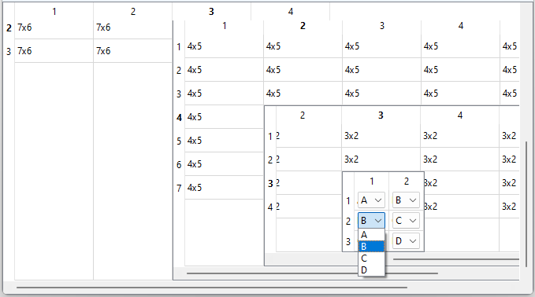

# Model View

## Multiple containers

Example of how to create a table managing data based on multiple containers. Here is considered the example of a 8 dimensions array. The type is a custom `enum`, and the editor is here managed by persistent dedicated widgets.

```cpp
glvm_SlvEnum(EnumName, A, B, C, D)
typedef EnumName Tvalue;
// Use alias for std::vector<std::vector<>> for simplicity
template <class T>
using Matrix = std::vector< std::vector<T> >;
```

```cpp
GlvTableView< Matrix< Matrix< Matrix< Matrix<Tvalue> > > >, GlvWidget, true>* table_view8D = new GlvTableView< Matrix< Matrix< Matrix< Matrix<Tvalue> > > >, GlvWidget, true>(matrix8D);
table_view8D->show();
```



The size of the intermediate editors adjusts automatically to manage navigation and edition on multiple dimensions.

More details in [sample004_0.cpp](/src/src_samples/src_sample004_0/sample004_0.cpp) and [sample004.cpp](/src/src_samples/src_sample004/sample004.cpp).

##### Remark

Containers of different types can be used together: <code>std::vector</code>, <code>std::map</code>, <code>std::array</code>, <code>std::list</code>, <code>std::deque</code>. Example in [sample004_6.cpp](/src/src_samples/src_sample004_6/sample004_6.cpp).