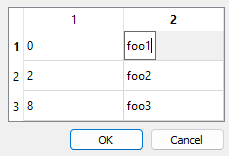
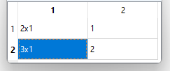
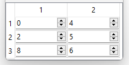
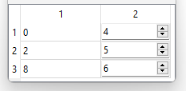

# Model View

## std::map

Example of how to create a simple table from a `std::map`.

```cpp
 std::map<int, std::string> map;
 map[0] = "foo1";
 map[2] = "foo2";
 map[8] = "foo3";

 GlvTableDialog< std::map<int, std::string> > map_dialog;
 map_dialog.get_table_view()->set_value(map);

 if (map_dialog.exec()) {
     std::cout << map_dialog.get_widget()->get_value() << std::endl;
 }
```



More details in [sample004_5.cpp](/src/src_samples/src_sample004_5/sample004_5.cpp).

#### Remark 1

The key of the <code>std::map</code> may not be editable in some cases. The reason is that the delegate is designed accordingly to the map's value type.

Example:

```cpp
std::map<std::vector<int>, int> map_vector2;
map_vector2[{ 1, 2 }] = 1;
map_vector2[{ 3, 4, 5 }] = 2;
GlvTableView< std::map<std::vector<int>, int> > map_vector2_table(map_vector2);
map_vector2_table.show();
```



Here the edition of the values (the second column) is possible, but the edition of they keys (the first column) is not.

#### Remark 2

If using a <code>GlvWidget</code> (see details [here](/doc/readme/ModelView/ModelView_widget_editor.md)), the widget will apply to the map's key provided the type is the same as the type of the map's value.

Example:

```cpp
std::map<int, int> map2;
map2[0] = 4;
map2[2] = 5;
map2[8] = 6;

GlvTableView<std::map<int, int>, GlvWidget> map2_table(map2);
map2_table.show();
```



If the types are differents:

```cpp
std::map<float, int> map3;
map3[0.f] = 4;
map3[2.f] = 5;
map3[8.f] = 6;

GlvTableView<std::map<float, int>, GlvWidget> map3_table(map3);
map3_table.show();
```


