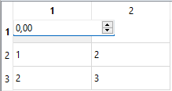
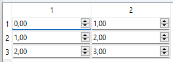

# Model View

## Widget editor

It is possible to replace the editor of the data with a specialized widget provided a `GlvWidgetData` specialization is defined (see section [GlvWidgetData specializations](/doc/readme/GlvWidgetData_specs.md) )

In this example is presented how to use the specialized widget associated to the data by adding a `GlvWidget` as second template argument of `GlvTableView`.

```cpp
GlvTableView<Matrix<Tvalue>, GlvWidget>* table_view2D = new GlvTableView< Matrix<Tvalue>, GlvWidget>(matrix2D);
table_view2D->show();
```



To use persistent editors, simply add the template argument <code>true</code>.

```cpp
GlvTableView<Matrix<Tvalue>, GlvWidget, true>* table_view2D_persistent = new GlvTableView< Matrix<Tvalue>, GlvWidget, true>(matrix2D);
table_view2D_persistent->show();
```



More details in [sample004_3.cpp](/src/src_samples/src_sample004_3/sample004_3.cpp).