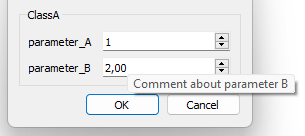

# Class parametrization

## Basic

Example for a basic class parametrization. In this example a class has two parameters of types <code>int</code> and <code>double</code>.

```cpp
#include "param/SlvParametrization2.h"

class ClassA : public SlvParametrization2<int, double> {

    glvm_parametrization2_init("ClassA") // static name of the parametered class
    // parameter index, variable name, type, name of the parameter, comment about the parameter, default value
    glvm_parameter(1, paramA, int, "parameter_A", "Comment about parameter A", 1)
    glvm_parameter(2, paramB, double, "parameter_B", "Comment about parameter B", 2.)

public:

    ClassA() : glvm_parametrization_constructor(paramA, paramB) {}
}
```

At this stage, Qt is not used at all, and the parametrization can be handled such as:

```cpp
ClassA classA;
classA.get_paramA();//get paramA value : const method
classA.set_paramA(4);//set paramA value.
// => Calls ClassA::param_init(), virtual method in charge of parameters 'pre-processing' that can be reimplemented
// param_init() is called each time a parameter value is modified
// Exception: direct assignment of parameters using param_cast(). More details in sample002_1
```

##### List of Implemented public methods

The macro <code>glvm_parameter</code> implements the following public methods, considering <code>Tfoo</code> the parameter type and <code>foo</code> its implementation name:

- <code>const Tfoo& get_foo() const</code>
  
  - Return the value of *foo*

- <code>void set_foo(const Tfoo& _foo, bool _l_param_only = true)</code>
  
  - Set the value of *foo*

- <code>static const std::string& get_foo_pname()</code>
  
  - Return the static name of *foo*

##### Assignment operator

To assign parameters only and avoid assigning members not related to parametrization, casting to the inherited <code>SlvParametrization</code> is necessary. It is recommended to use the <code>param_assign</code> method which is equivalent to <code>param_cast() =</code>.

```cpp
classA.param_cast();// returns the inherited SlvParametrization
ClassA classA2;
classA.param_assign(classA2);// assign parameters of classA2 to classA
classA.param_cast() = classA2;// equivalent to previous line
```

##### param_init()

Each time a parameter is modified, by either (following the example above):

- <code>set_paramA()</code>

- or <code>ClassA::operator=</code>

the virtual method <code>param_init()</code> is called. Its implementation is not mandatory in the parameterized class. Implementing this method can be convenient to update class members directly deriving from parameter values. **Caution**: because this method is virtual, calling the method is required in the class constructor (if <code>param_init()</code> is necessary).

More details about assignment and parameters initalization are presented in [sample002_1.cpp](/src/src_samples/src_sample002_1/sample002_1.cpp).

### Qt handling

The parametered class defined above can be easily translated to a widget interface. 

For a dialog widget, simply use:

```cpp
GlvParametrizationDialog<ClassA>* parametrization_classA_dialog = new GlvParametrizationDialog<ClassA>();
parametrization_classA_dialog->exec();
```



Alternatively, a simple widget, <code>GlvParametrizationWidget</code> can be used (not a <code>QDialog</code> this time):

```cpp
GlvParametrizationWidget<ClassA>* parametrization_classA_widget = new GlvParametrizationWidget<ClassA>();
```

More details in [sample001_1.cpp](/src/src_samples/src_sample001_1/sample001_1.cpp).

##### Remark

The macro `glvm_parametrization` can be used to declare a basic parametrization as follow:

```cpp
glvm_parametrization(ClassA, "ClassA",
                             paramA, int, "parameter_A", "Comment about parameter A", 1
                             paramB, double, "parameter_B", "Comment about parameter B", 2.)
```

But in this case, you can naturally not declare additional members in the class.
The macro is however convenient to simply declare a set of parameters, with a straightforward Qt handling.

#### Widget accessor

Each widget of the parametrization can be accessed by using the preprocessor macro <code>glvm_get_parameter_GlvWidgetData</code> designed for convenience. The first argument is a <code>GlvParametrizationWidget\<T></code>, the second one is the index of the parameter.

```cpp
GlvWidgetData<int>* widget_paramA = glvm_get_parameter_GlvWidgetData(parametrization_classA_dialog->get_parametrization_widget(), 1);
// Or:
GlvWidgetData<double>* widget_paramB = glvm_get_parameter_GlvWidgetData(parametrization_classA_widget , 2);
```

Depending on the specialization of <code>GlvWidgetData\<T></code> it is possible to handle the parameter widget. For instance, <code>GlvWidgetData\<int></code> inherits the class *QSpinBox*.

You can find the list of type specializations here [GlvWidgetData_specs.md](/doc/readme/GlvWidgetData_specs.md).

#### Widgets range and decimals

The range for numerical values (*QSpinBox* and *QDoubleSpinBox*) is defined as the intersection of the largest possible of the corresponding type and the largest possible of the input widget.

The number of decimals of *QDoubleSpinBox* for <code>float</code> and <code>double</code> types depends on the construction value. In the example above, we have <code>double _paramB = 2.</code>, and the number of decimals will be 2 as the default minimum. If we had <code>double _paramB = 2.001</code>, the number of decimals of *QDoubleSpinBox* would be 3.

Range and decimals details can be found here [GlvWidgetData_specs.md](/doc/readme/GlvWidgetData_specs.md).