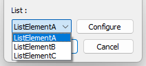

# Class parametrization

## List

It is possible to gather multiple parametrization in a list, thus offering more possibilities for parametrization. Eventually, configuration of the parametrizations is possible by selecting which one a user wants to use, by using a `QComboBox`. After configuration and validation, the accepted parametrization can be used.

This approach requires:

- A class containing two static methods:
  
  - <code>static std::string name()</code> : the name of the list
  
  - <code>static const std::vector<std::string>& list()</code> : the parametrization names

- A macro associating each parametrization name to its corresponding type

- A specialization of the structure in charge of creating the parametrization widgets

As an example, the two first items are implemented in the following code snippet. Let us consider the list <code>List</code> gathering the three possible parametrizations <code>ListElementA</code>, <code>ListElementB</code> and <code>ListElementC</code>.

```cpp
#include "param/SlvParametrizationMacro.h"

// Declare 3 basic parametrizations
glvm_parametrization(ListElementA, "ListElementA", paramA, double, "paramA", "comment parameterA", 0.)
glvm_parametrization(ListElementB, "ListElementB", paramA, bool, "paramA", "comment parameterA", true)
glvm_parametrization(ListElementC, "ListElementC", paramA, std::string, "paramA", "comment parameterA", "default")

// Define the macro associating each parametrization name to its corresponding type
#define glvm_List_instruction_name_to_type(instruction_front, parametrization_name, instruction_end)\
if (parametrization_name==ListElementA::name()) {instruction_front ListElementA instruction_end}\
else if (parametrization_name==ListElementB::name()) {instruction_front ListElementB instruction_end}\
else if (parametrization_name==ListElementC::name()) {instruction_front ListElementC instruction_end}\
else { slv::flag::ISSUE(slv::flag::Critical, "No such parametrization name = ", parametrization_name); }

#include <vector>
#include <string>

/* Declare the list of the parametrizations
* Requirements:
* - static std::vector<std::string> list() method
* - static std::string name() method.
* - static bool is_templated(onst std::string _name) method
* Simply build a std::vector storing the names of the listed parametrizations.*/
class List {
public:
    static std::string name() const { return "List"; }
    static const std::vector<std::string>& list() {
        static const std::vector<std::string>* list = new std::vector<std::string>({
            ListElementA::name(),
            ListElementB::name(),
            ListElementC::name()
        });
        return *list;
    }
    // Whether a parametrization (by name) is a template or not.
    static bool is_templated(const std::string _name) {
        // No parametrization is templated here
        return false;
}
};
```

In the same example, the third item is implemented below. For a Qt usage, <code>struct GlvParamListDialog_Open_Spec</code> must be specialized. This is where the macro in charge of the mapping from name to parametrization is used.

```cpp
template <>
struct GlvParamListDialog_Open_Spec<List> {

    /*! Creates new GlvParametrizationDialog.
    * Only replace preprocessor macro.*/
    template <class Toption>
    static bool build_parametrization_templated(GlvParametrizationDialog_base*& _configure_window, std::string _item_name, const Toption* _option, bool _l_show, QWidget* _parent) {
        bool l_created = false;
        return l_created;
    }

    /*! Creates new GlvParametrizationDialog.
    * Only replace preprocessor macro.*/
    template <class Toption>
    static GlvParametrizationDialog_base* build_parametrization(std::string _item_name, QWidget* _parent) {
        GlvParametrizationDialog_base* parametrization_dialog = NULL;
        glvm_List_instruction_name_to_type(parametrization_dialog = new GlvParametrizationDialog<,
            _item_name,
        >(_parent);)
        return parametrization_dialog;
    }

    /*! Applies optional changes to the created parametrization widget.*/
    template <class Toption>
    static void configuration(GlvParametrizationDialog_base* _configure_window, std::string _item_name, const Toption* _option) {

    }
};
```

### Qt handling

The list can now be used in a <code>GlvParamListDialog</code>:

```cpp
GlvParamListDialog<List>* list_dialog = new GlvParamListDialog<List>();

int result = list_dialog->exec();
if (result == QDialog::Accepted) {
    // Access the configured type through a template function
    glvm_instruction_base_to_dcast_const(List, func PARENTHESIS1, list_dialog->get_parametrization_base(), PARENTHESIS2;)
}
```

with <code>func</code> being a template function catching the parametrization.

```cpp
template <class T>
void func(const T* _parametrization) {
    std::cout << *_parametrization << std::endl;
}
```

Select the parametrization in the list, and configure it if necessary. The *Configure* button will pop up a <code>GlvParametrizationDialog</code>.



More details in [sample003.cpp](/src/src_samples/src_sample003/sample003.cpp).

For an advanced management of lists, including two levels of template, and static filtering of the items of the list depending on another type, see [sample003_1.cpp](/src/src_samples/src_sample003_1/sample003_1.cpp) and [sample003_2.cpp](/src/src_samples/src_sample003_2/sample003_2.cpp).
