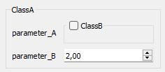
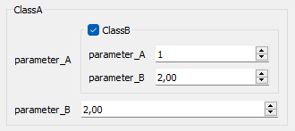

# Class parametrization

## Nested

Example of nested class parametrizations. In this example, a parameter is another parametrization.

```cpp
class ClassB : public SlvParametrization2<int, double> {

    glvm_parametrization2_init("ClassB")

    glvm_parameter(1, paramA, int, "parameter_A", "Comment about parameter A", 1)
    glvm_parameter(2, paramB, double, "parameter_B", "Comment about parameter B", 2.)

public:

    ClassB() : glvm_parametrization_constructor(paramA, paramB) {}
};

class ClassA : public SlvParametrization2<ClassB, double> {

    glvm_parametrization2_init("ClassA")

    glvm_parameter(1, paramA, ClassB, "parameter_A", "Comment about parameter A")
    glvm_parameter(2, paramB, double, "parameter_B", "Comment about parameter B", 2.)

public:

    ClassA() : glvm_parametrization_constructor(paramA, paramB) {}
};
```

*The example above is equivalent to using the macro <code>glvm_parametrization</code> detailed [here](/doc/readme/Parametrization/Parametrization_basic.md#remark).*

At this stage, Qt is not used at all, and the parametrization can be handled such as:

```cpp
ClassA classA;
classA.get_paramA().get_paramA();
```

However, setting a parameter value of a nested parametrization is not straightforward and requires a local copy:

```cpp
ClassA classA;
ClassB classB = classA.get_paramA();
classB.set_paramA(7);
classA.set_paramA(classB);
```

### Qt handling

The parametered class can be easily translated to a widget interface.

For example, for a widget, simply use:

```cpp
GlvParametrizationWidget<ClassA>* parametrization_classA = new GlvParametrizationWidget<ClassA>();
```

which gives:



By default, nested parametrizations are hidden. To show them, simply click on the corresponding button:



This behaviour is convenient when designing *advanced* parameters for instance.

More details in [sample001_2.cpp](/src/src_samples/src_sample001_2/sample001_2.cpp)

##### Remark

There is no known limitations regarding the number of nested parametrizations, except hardware limitations (memory size, but very unlikely) and compiler limitations. For example with GCC, one can consider the *-ftemplate-depth* option.
