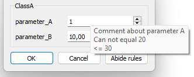

# Class parametrization

## Rules

The parameters of a class can also contain rules. A simple example is presented below.

```cpp
class ClassA : public SlvParametrization2<int, double> {

    glvm_parametrization2_init("ClassA")

    glvm_parameter_ruled(1, paramA, int, "parameter_A", "Comment about parameter A", 1)
    glvm_parameter_add_rule(exception, 20)
    glvm_parameter_add_rule(max, 30)
    glvm_parameter_end
    glvm_parameter_ruled(2, paramB, double, "parameter_B", "Comment about parameter B", 2.)
    glvm_parameter_add_rule(min_exception, 10)
    glvm_parameter_end

public:

    ClassA() : glvm_parametrization_constructor(paramA, paramB) {}
};
```

At this stage, Qt is not used at all, and the parametrization can be handled such as:

```cpp
ClassA classA;
// set_paramA returns as status because ClassA::paramA is ruled
SlvStatus status = classA.set_paramA(31);
// classA.set_paramA_unruled(31); //set ClassA::paramA ignoring rules
if (!status) {
    std::cout << status << std::endl;
    // Output: {Parameter parameter_A value 31 can not be greater than 30, warning}
}
classA.param_init();// parameters 'pre-processing'. Virtual method that can be reimplemented.
```

The ruled parametrization does not abide the rules automatically at construction. For instance here, default value of <code>paramB</code> (2) does not abide its rule. Checking the rules and abiding them is possible by using:

```cpp
status = classA.check_parameters();
if (!status) {
    std::cout << status << std::endl;
    // Output: {Parameter parameter_B valued 2 can not be lower/eq than 10, warning}
    classA.abide_rules();
    std::cout << classA << std::endl;
    // Output : parameter1 : parameter_A = 1
    //          parameter2 : parameter_B = 11
}
```

The reason for not checking the rules at construction is that in some cases it is relevant to evaluate if the parameters are abiding the rules or not after the construction of a parametrization.

### Qt handling

The parametered class can be easily translated to a widget interface.

For a dialog widget, simply use:

```cpp
GlvParametrizationDialog<ClassA>* parametrization_dialog = new GlvParametrizationDialog<ClassA>();
parametrization_dialog->exec();
```

The widget now applies range rules, and can manage exceptions (or other rules) by using the *Abide rules* button. For example, the value of *parameter_B* is here intrinsically subject to the range of the spin box, but the exception has to be managed either manually or using the *Abide rules* button. If using the second strategy, an attempt to increase or decrease the value by one will be performed untill finding a correct value.



More details in [sample002.cpp](/src/src_samples/src_sample002/sample002.cpp).
For an advanced management of rules, see [sample002_1.cpp](/src/src_samples/src_sample002_1/sample002_1.cpp).

### List of rules

For arithmetic types, the rules are:

| Rule            | Correspondent sign  |
| --------------- | ------------------- |
| *exception*     | value ≠       rule  |
| *min*           | value ≥        rule |
| *max*           | value ≤        rule |
| *min_exception* | value >      rule   |
| *max_exception* | value <    rule     |

##### Remark 1

The macro `glvm_parametrization` does not allow the management of rules.

##### Remark 2

Whenever a value is changed in the <code>GlvParametrizationDialog</code>, virtual method <code>SlvParametrization_base::param_init()</code> is called. 
