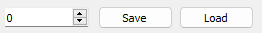
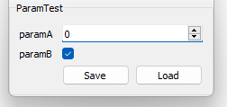
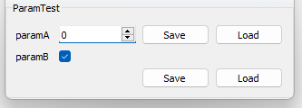
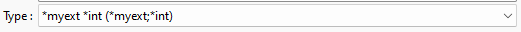

# Save and load

An interface for saving and loading values can be added to any *GlvWidget* or *GlvParametrizationWidget* provided the binary parser for every type involved is implemented.

### Basic widget

Let us consider the simple widget <code>GlvWidget<int></code> for an <code>int</code> value:

```cpp
// Create an int widget
GlvWidget<int>* widget = new GlvWidget<int>;
// Associate a save/load interface to this widget.
GlvWidgetSaveLoad<int>* save_load_widget = new GlvWidgetSaveLoad<int>(widget);
widget->show();
```

The result is:



The save/load interface is instantiated outside of the widget implementation. The reason is the managed types may not have the binary read/write methods implemented.
Consequently, this approach provides more flexibility.

To create the interface,`slv::rw::writeB` and `slv::rw::readB` must have a specialization for type `T`, or <code>T</code> must have <code>writeB</code> and <code>readB</code> methods implemented. See [this page](/doc/readme/ReadWriteFile/ReadWriteFile_class_binary.md) for more details about read and write implementation.

### Parametrization widget

It is also possible to manage save and load of a full parametrization easily.

Considering a basic parametrization such as:

```cpp
glvm_parametrization(ParamTest, "ParamTest",
                                              paramA, int, "paramA", "comment about parameterA", 0,
                                              paramB, bool, "paramB", "comment about parameterB", true)
```

the parametrization widget and its save/load interface are constructed as follows:

```cpp
GlvParametrizationWidget<ParamTest>* param_test_widget = new GlvParametrizationWidget<ParamTest>;
GlvParametrizationSaveLoad<ParamTest>* save_load_widget_ParamTest = new GlvParametrizationSaveLoad<ParamTest>(param_test_widget);
param_test_widget->show();
```

The result is:



##### Remark

It is important to notice that saving a parametrization only saves the parameters of the instance, not the whole instance. The same goes for loading.

This differenciation comes from the fact that the read and write methods called are the ones of the inherited `SlvParametrization**`, and not those of the inherited instance (if they are implemented).

You can see an example of this differenciation in a general context (not related to save/load interface) in [sample001_2.cpp](/src/src_samples/src_sample001_2/sample001_2.cpp).

### Add save/load to a parameter

A save/load interface can also be added to a specific parameter. For this purpose, one can use the macro <code>glvm_get_parameter_GlvWidget</code> for a convenient access to the corresponding <code>GlvWidget</code> of the parameter.

```cpp
GlvWidgetSaveLoad<int>* save_load_widget_int = new GlvWidgetSaveLoad<int>(glvm_get_parameter_GlvWidget(param_test_widget, 1));
```

The result is:



##### Remark

The buttons of the save/load interface can be aligned horizontally or vertically using the method: <code>set_orientation(Qt::Orientation)</code>. The default orientation is horizontal for <code>GlvWidget</code> and <code>GlvParametrizationWidget</code>.

More details and examples can be found in [sample009.cpp](/src/src_samples/src_sample009/sample009.cpp).

### Allowed file extensions

By default the allowed file extension is the static name of the type according to the template structure <code>SlvDataName</code>. For example if, type is *int*, then the allowed extension will be *.int*. More information about the structure can be found at [SlvDataName](/doc/readme/SlvDataName.md).

It is possible to add allowed file extensions to the save/load interface, by doing:

```cpp
GlvWidgetSaveLoad<int>* save_load_widget_int = new GlvWidgetSaveLoad<int>(widget, {"myext"});
```

Or:

```cpp
SlvFileExtensions allowed_extensions = save_load_widget_int->get_allowed_extensions();
allowed_extensions.add_front("myext");
save_load_widget_int->set_allowed_extensions(allowed_extensions);
```

Producing:

 

### Specializations for read and write

The types manages for the save/load interface are the ones manages for binary read an write.
Specializations for common types and containers are provided at [this page](/doc/readme/ReadWriteFile/ReadWriteFile_specs.md).