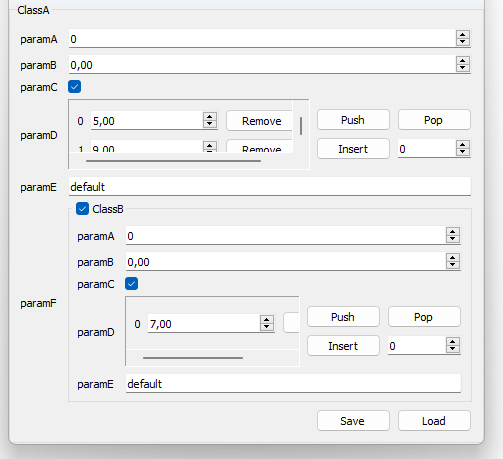
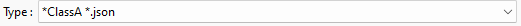

# Save and load : *json*

### Third-party library

The third party library used is [GitHub - nlohmann/json: JSON for Modern C++](https://github.com/nlohmann/json). The single header *json.hpp* is used and can be found in the folder */thirdParty/json* of the *Glove* repository. Of course, it is also possible to use the *json.hpp* of the json repository.

When using the single header *glove.h* (option 1), the json management is disabled by default. The macro <code>#define GLOVE_ENABLE_JSON</code> must be defined before <code>#include "glove.h"</code>.

When using the *Glove* library from the installed includes and built libraries (option 2), the json management is enabled by default. The file *json.hpp* is also part of the installed third party libraries. So by default the json management is operational.

### Introduction

As an extension of the save/load interface introduced [here](/doc/readme/SaveLoad/SaveLoad_binary.md), it is possible to save and load a **parametrization** using the *json* formating.

This extension applies only on *GlvParametrizationWidget*, using the parameters name and value as *json* fields and values.

The following types and containers are managed by default by the json library:

- arithmetic types

- enum

- std::string

- std::vector

- std::map

### Example

Let us consider two simple parametrizations *ClassA* and *ClassB* :

```cpp
glvm_parametrization(ClassB, "ClassB", paramA, int, "paramA", "comment about parameterA", 0,
                                        paramB, float, "paramB", "comment about parameter B", 0.f,
                                        paramC, bool, "paramC", "comment about parameter C", true,
                                        paramD, std::vector<double>, "paramD", "comment about parameter D", {7.},
                                        paramE, std::string, "paramE", "comment about parameter E", "default")
glvm_parametrization(ClassA, "ClassA", paramA, int, "paramA", "comment about parameterA", 0,
                                        paramB, float, "paramB", "comment about parameter B", 0.f,
                                        paramC, bool, "paramC", "comment about parameter C", true,
                                        paramD, std::vector<double>, "paramD", "comment about parameter D", std::vector<double>({5., 9.},
                                        paramE, std::string, "paramE", "comment about parameter E", "default",
                                        paramF, ClassB, "paramF", "comment about parameter F", ClassB())
```

```cpp
GlvParametrizationWidget<ClassA>* param_widget = new GlvParametrizationWidget<ClassA>;
GlvParametrizationSaveLoad<ClassA>* save_load_widget = new GlvParametrizationSaveLoad<ClassA>(param_widget);
param_widget->show();
```

The obtained parametrization widget is shown below.



Using *Save*:



and applying *.json* extension, we obtain the following json file. The file can be modified and loaded back for instance.

```json
{
    "ClassA": {
        "paramA": 0,
        "paramB": 0.0,
        "paramC": true,
        "paramD": [
            5.0,
            9.0
        ],
        "paramE": "default",
        "paramF": {
            "ClassB": {
                "paramA": 0,
                "paramB": 0.0,
                "paramC": true,
                "paramD": [
                    7.0
                ],
                "paramE": "default"
            }
        }
    }
}
```

More details and examples can be found in [sample009_1.cpp](/src/src_samples/src_sample009_1/sample009_1.cpp). 

### Specific json for other types

Types that are not managed by default by the json library must have their parsing implemented. You can either specialize read and write functions, or implement methods (if the type is a class you can modify). Let us consider a class `ClassTest`:

```cpp
class ClassTest {
    int value;
public:
    ClassTest(int _value = 2) { value = _value; }
    ~ClassTest() {}
    int get_value() const { return value;}
    void set_value(const int _value) { value = _value; }
    bool readB(std::ifstream& _input_file) {
        return slv::rw::readB(value, _input_file);
    }
    void writeB(std::ofstream& _output_file) const {
        slv::rw::writeB(value, _output_file);
    }

    friend std::ostream& operator<<(std::ostream& _os, const ClassTest& _test) {
        _os << _test.value;
        return _os;
    }
    friend std::istream& operator>>(std::istream& _is, ClassTest& _test) {
        _is >> _test.value;
        return _is;
    }

    void writeJson(nlohmann::json& _json) const {
        _json = value;
    }
    SlvStatus readJson(const nlohmann::json& _json) {
        value = _json.get<int>();
        return SlvStatus();
    }
};
```

a specialization of read and write functions such as:

```cpp
template <>
void slv::rw::json::writeJson_spec<ClassTest>(const ClassTest& _test, nlohmann::json& _json) {
    _json = _test.get_value();
}

template <>
SlvStatus slv::rw::json::readJson_spec<ClassTest>(ClassTest& _test, const nlohmann::json& _json) {
    _test.set_value(_json.get<int>());
    return SlvStatus();
}
```

and a parametrization such as:

```cpp
glvm_parametrization(ClassA, "ClassA", paramA, int, "paramA", "comment about parameterA", 0,
                                        paramB, float, "paramB", "comment about parameter B", 0.f,
                                        paramC, bool, "paramC", "comment about parameter C", true,
                                        paramD, std::vector<double>, "paramD", "comment about parameter D", {},
                                        paramE, std::string, "paramE", "comment about parameter E", "default",
                                        paramF, ClassTest, "paramF", "comment about parameter F", ClassTest())
```

When showing the corresponding parametrization widget, the *Save*/*Load* buttons will propose the json parsing by showing the *.json* extension. The parser used here will be the specialization of <code>slv::rw::json::writeJson_spec</code> and <code>slv::rw::json::readJson</code>. Indeed, several options exist for the json save/load option to be enabled. The functions/methods enabling it are (by priority order of their actual use if available together):

- Specialize <code>writeJson_spec</code> and <code>readJson_spec</code>

- Implement <code>writeJson</code> and <code>readJson</code> methods

- Implement <code>ofstream</code> and <code>ifstream</code> methods (see [this page](/doc/readme/ReadWriteFile/ReadWriteFile_class_text.md))

- Implement <code>ostream</code> and <code>istream</code> methods (see [this page](/doc/readme/ReadWriteFile/ReadWriteFile_class_IO.md))

- Implement << / >> operators

If any of the implementation is available, *json* save/load will be proposed.

More details and examples can be found in [sample009_2.cpp](/src/src_samples/src_sample009_2/sample009_2.cpp).

##### Remark 1

Save/load of parametrization using *json* requires all the involved types (recursively) to be managed. If one type does not have both read and write possibilities (*i.e.* a full line of the list above), the the *.json* option of the Save/Load buttons will be disabled.

##### Remark 2

Unlike the binary parser described [here](/doc/readme/SaveLoad/SaveLoad_binary.md), the lack of methods for *json* parsing will not produce compilation errors. It means that as long as both `slv::rw::writeB` and `slv::rw::readB` are properly specialized or both `writeB` and `readB` methods are implemented (this is the case for <code>ClassTest</code>), using:

```cpp
GlvParametrizationSaveLoad<ClassA>* save_load_widget = new GlvParametrizationSaveLoad<ClassA>(param_widget);
```